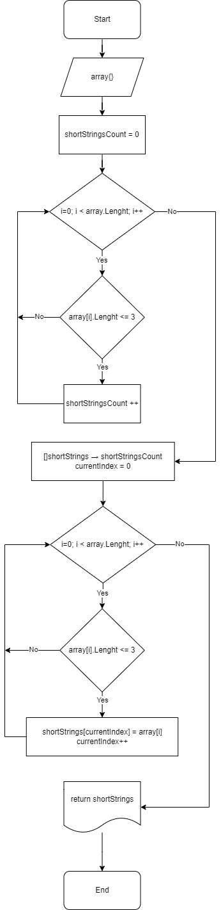

# Описание решения

Этот репозиторий содержит простое приложение на C#, которое выполняет следующие задачи:

1. Пользовательский ввод: Приложение позволяет пользователю ввести строки, разделенные запятыми.

3. Фильтрация коротких строк: После ввода строк приложение фильтрует исходный массив строк, оставляя только те строки, которые имеют длину не более 3 символов.

4. Вывод результатов: После фильтрации приложение выводит исходный массив строк и массив коротких строк.

  

